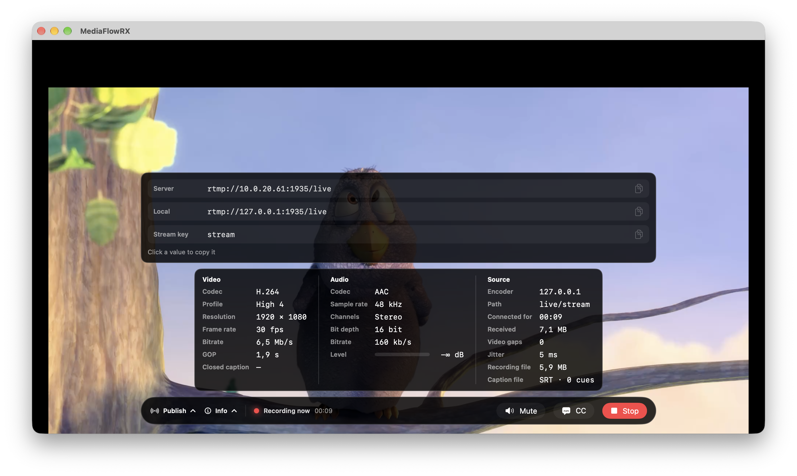
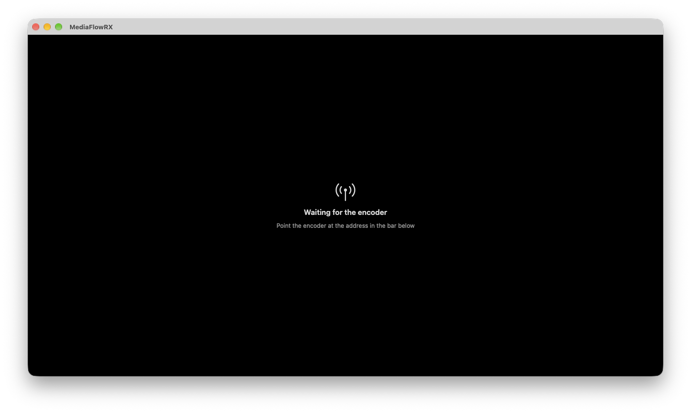
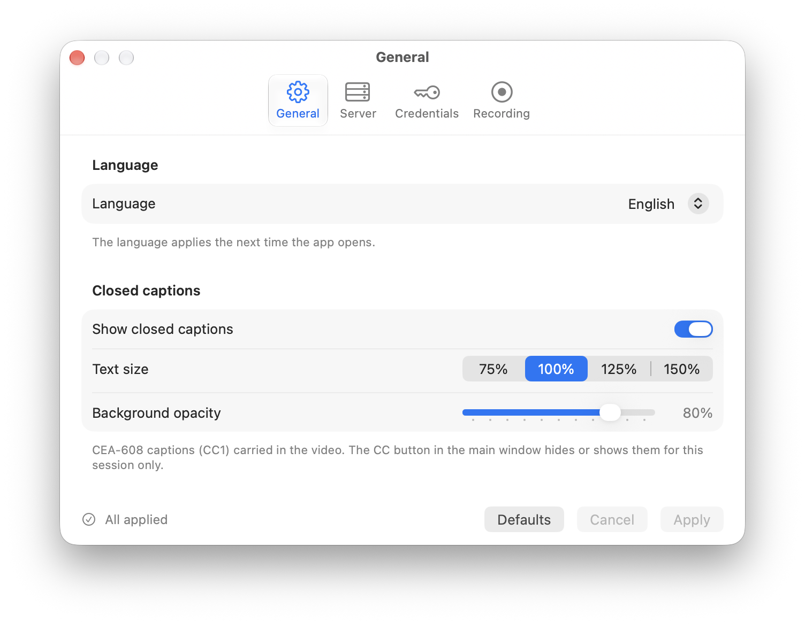
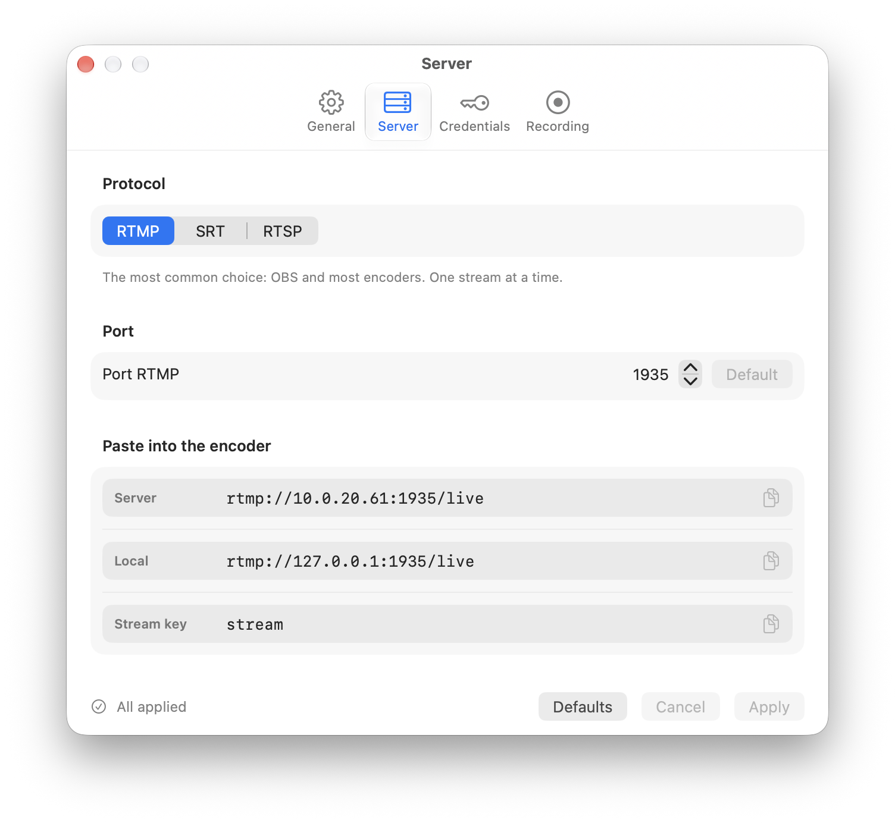
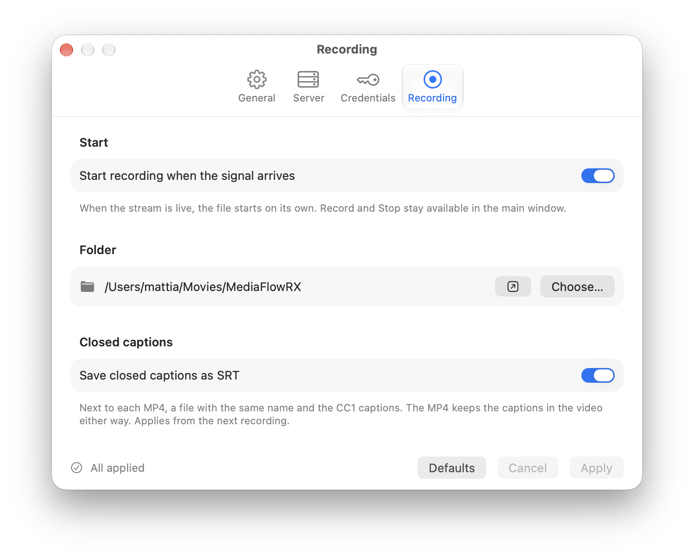

# MediaFlowRX

Native macOS app that receives one live stream published by an encoder, previews it, and records it to MP4 without re-encoding.

The encoder pushes to the Mac. MediaFlowRX does not pull from a camera.

<p align="center">
  
</p>
<p align="center">
  
</p>
<p align="center">
  
  
  
</p>

## Features

- One listener at a time: RTMP, SRT, or RTSP
- Preview that keeps the source aspect ratio, with mute as the only audio control
- MP4 remux of the incoming H.264 or HEVC and AAC (no transcode)
- Record button, or automatic recording when the stream connects
- Final file name: `{slug}_yyyy-MM-dd_HH-mm-ss.mp4`
- If the encoder drops, or sends nothing for 5 seconds, the file is closed. When the stream returns, a new file starts
- CEA-608 closed captions (CC1) carried in the H.264 or HEVC video, on RTMP, SRT, and RTSP: shown over the preview, and saved as an SRT next to the MP4
- Interface in English and Italian

Default ports, all editable in Settings: RTMP `1935`, SRT `9000`, RTSP `8554`. Slug and stream key are required. A second publisher is rejected while the first one is on air.

## Language

The app ships in English and Italian. On first launch it follows the Mac language. In Settings → General you can choose System, English, or Italian. The new language applies the next time the app opens.

## Requirements

- macOS 14 or later
- Intel or Apple silicon
- An encoder that can publish RTMP or SRT (OBS, Epiphan Pearl, or equivalent). RTSP publish is for devices that push RTSP (OBS does not)

The app is not sandboxed: it has to accept incoming connections on the chosen port.

## Use

1. Copy MediaFlowRX to Applications, then clear the download quarantine so macOS will open it:

   ```sh
   xattr -dr com.apple.quarantine /Applications/MediaFlowRX.app
   ```

2. Open Settings and choose the protocol, port, slug, and key.
3. Copy the publish URL shown in the main window into the encoder.
4. Start the stream. The window goes on air, and Record becomes available.

RTMP, for OBS: server `rtmp://<mac>:1935/live`, stream key `stream`.

SRT, for OBS: server `srt://<mac>:9000`, stream id `#!::r=live/stream,m=publish`. SRT is not encrypted.

RTSP: `rtsp://<mac>:8554/live/stream`.

Username and password are optional. When set in Settings, the encoder must send them: after the stream key on RTMP (`stream?user=…&pass=…`), in the URL query on RTSP (`?user=…&pass=…`), in the stream id on SRT (`,user=…,pass=…`). With both empty, slug and key are enough.

`live` and `stream` are the defaults. The window always shows the URL that matches the current settings.

Recordings are fragmented MP4: the file is written as the stream comes in, so a crash or power loss costs only the last seconds.

## Closed captions

MediaFlowRX reads CEA-608 captions from the video (the A/53 `GA94` SEI that OBS writes when captions are enabled, as do most broadcast encoders). Only channel CC1 is shown and saved. Info lists every service it finds, CEA-708 included, but 708 is not decoded.

- Settings → General → Show closed captions: whether the window opens with captions on. The CC button, or ⇧⌘C, hides or shows them for the current session only. Text size (75% to 150%) and the opacity of the box behind the text are set there too. Position and colors come from the stream.
- Settings → Recording → Save closed captions as SRT: next to each MP4, an SRT with the same name (`{slug}_yyyy-MM-dd_HH-mm-ss.srt`), timed on the MP4. No SRT when the recording has no captions.

The MP4 is not altered, so the captions stay in its video too: players that read captions from the video, such as VLC and ffmpeg, show them without the SRT. QuickTime does not: it needs a separate caption track.

## Build

```sh
./scripts/build-zlm.sh
```

The script clones ZLMediaKit into `third_party/` (not part of this repository) at the commit pinned in the script, and builds `libmk_api.dylib`. It does the same with [libcaption](https://github.com/szatmary/libcaption) (MIT), linked statically for the closed captions. To try another version: `ZLM_COMMIT=<sha> ./scripts/build-zlm.sh`. Then open `MediaFlowRX.xcodeproj` and run the MediaFlowRX scheme.

A disk image:

```sh
./scripts/make-dmg.sh
```

The image is written to `dist/MediaFlowRX.dmg`.
