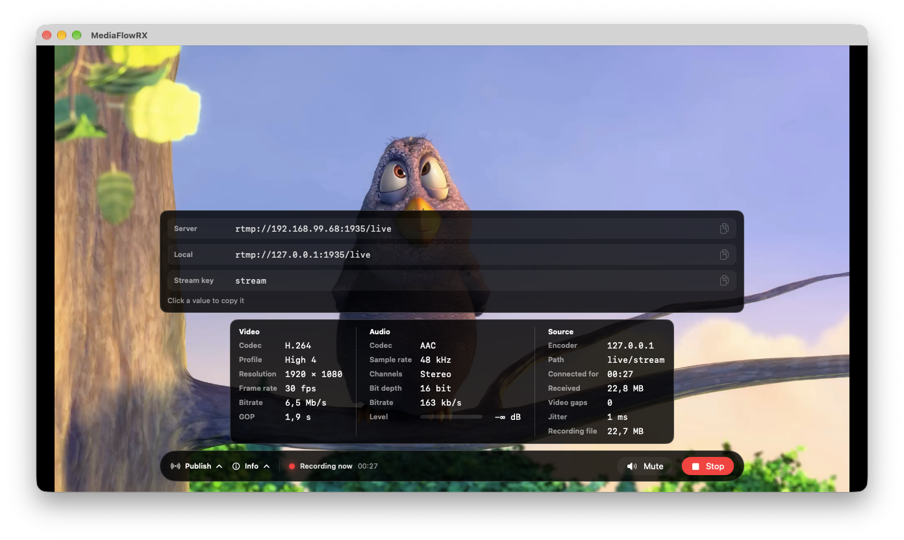
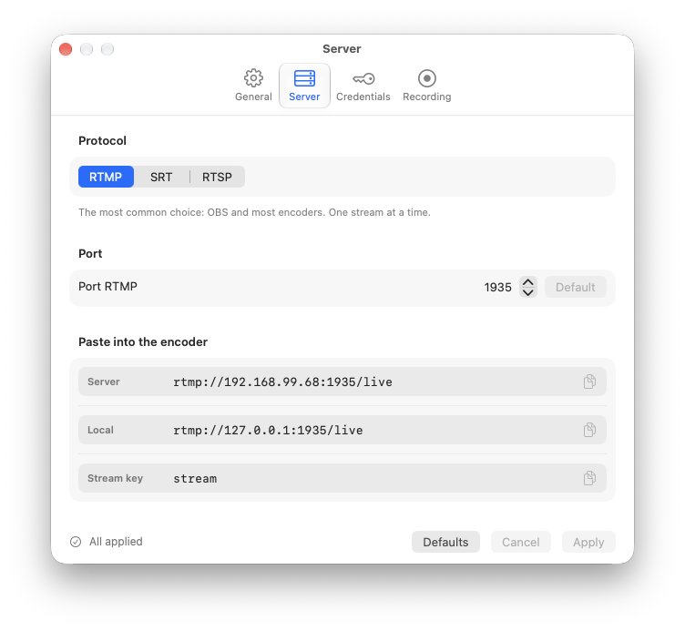

# MediaFlowRX

Native macOS app that receives one live stream published by an encoder, previews it, and records it to MP4 without re-encoding.

The encoder pushes to the Mac. MediaFlowRX does not pull from a camera.

<p align="center">
  
</p>
<p align="center">
  
</p>
<p align="center">
  
</p>

## Features

- One listener at a time: RTMP, SRT, or RTSP
- Preview that keeps the source aspect ratio, with mute as the only audio control
- MP4 remux of the incoming H.264 or HEVC and AAC (no transcode)
- Record button, or automatic recording when the stream connects
- If the encoder drops, the same file continues when it returns within the grace period
- Final file name: `{slug}_yyyy-MM-dd_HH-mm-ss.mp4`
- Interface in English and Italian

Default ports, all editable in Settings: RTMP `1935`, SRT `9000`, RTSP `8554`. Slug and stream key are required. A second publisher is rejected while the first one is on air. The same slug and key may reconnect during the grace period.

## Language

The app ships in English and Italian. On first launch it follows the Mac language. In Settings → General you can choose System, English, or Italian. The new language applies the next time the app opens.

## Requirements

- macOS 14 or later
- Intel or Apple silicon
- An encoder that can publish RTMP or SRT (OBS, Epiphan Pearl, or equivalent). RTSP publish is for devices that push RTSP (OBS does not)

The app is not sandboxed: it has to accept incoming connections on the chosen port.

## Use

1. Open Settings and choose the protocol, port, slug, and key.
2. Copy the publish URL shown in the main window into the encoder.
3. Start the stream. The window goes on air, and Record becomes available.

RTMP, for OBS: server `rtmp://<mac>:1935/live`, stream key `stream`.

SRT, for OBS: server `srt://<mac>:9000`, stream id `#!::r=live/stream,m=publish`. SRT is not encrypted. ZLMediaKit does not support an SRT passphrase.

RTSP: `rtsp://<mac>:8554/live/stream`. Username and password, if set in Settings, are RTSP credentials.

`live` and `stream` are the defaults. The window always shows the URL that matches the current settings.

The MP4 can be opened after recording stops: Stop, grace period elapsed, or the app quits. A crash in the middle can leave an unreadable file.

## Build

```sh
./scripts/build-zlm.sh
```

The script clones ZLMediaKit into `third_party/` (not part of this repository) and builds `libmk_api.dylib`. Then open `MediaFlowRX.xcodeproj` and run the MediaFlowRX scheme.

A disk image:

```sh
./scripts/make-dmg.sh
```

The image is written to `dist/MediaFlowRX.dmg`.
